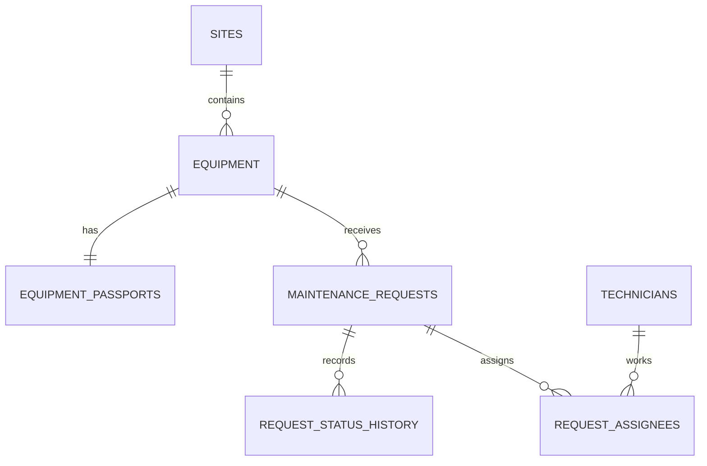

# ITKOR Service API — Case 2 + PostgreSQL

REST API для учёта площадок, оборудования, заявок на обслуживание и специалистов. Файловое хранилище Кейса 2 заменено на PostgreSQL; внешний контракт существующих маршрутов сохранён.

## Требования

- Node.js 20+
- Docker Desktop с Compose v2+
- npm 9+

## Запуск с нуля

```bash
npm install
copy .env.example .env          # Windows
# cp .env.example .env          # Linux/macOS
# задайте POSTGRES_PASSWORD в .env

docker compose up -d postgres
npm run db:migrate
npm run db:seed
npm start
```

PostgreSQL доступен на `localhost:${POSTGRES_PORT}`. Контейнер имеет healthcheck, а данные хранятся в именованном volume `itkor-postgres-data`.

Остановка:

```bash
docker compose down
```

Удаление данных PostgreSQL:

```bash
docker compose down -v
```

## Переменные окружения

| Переменная | Назначение |
|---|---|
| `PORT`, `NODE_ENV`, `CORS_ORIGINS` | HTTP и CORS |
| `RATE_LIMIT_WINDOW_MS`, `RATE_LIMIT_MAX` | rate limit API |
| `POSTGRES_HOST`, `POSTGRES_PORT`, `POSTGRES_DB`, `POSTGRES_USER`, `POSTGRES_PASSWORD` | подключение к PostgreSQL |
| `DB_POOL_MIN`, `DB_POOL_MAX`, `DB_POOL_ACQUIRE_MS`, `DB_POOL_IDLE_MS` | пул Sequelize |
| `DB_LOGGING` | логирование SQL (`true/false`) |
| `WEATHER_API_URL`, `REQUEST_TIMEOUT_MS`, `WEATHER_MAX_WIND_SPEED` | прогноз погоды |

Секреты хранятся только в `.env`; файл `.env` игнорируется Git.

## Миграции и сиды

```bash
npm run db:migrate       # применить все
npm run db:migrate:undo  # откатить последнюю
npm run db:seed          # 2 sites, 6 equipment, 5 technicians, 20 requests
npm run db:seed:undo     # откатить demo seed
```

Миграция создаёт таблицы `sites`, `equipment`, `equipment_passports`, `maintenance_requests`, `request_status_history`, `technicians`, `request_assignees`. Схема не создаётся через `sync`; используется только Sequelize CLI. `request_status_history` не имеет update/delete API. Внешний ключ оборудования на заявки — `ON DELETE RESTRICT`, поэтому удаление оборудования с любыми заявками запрещено на уровне БД; бизнес-слой дополнительно запрещает удаление при открытых заявках.

## Основные маршруты

Существующий контракт Кейса 2 сохраняется:

- `GET /api/health`
- `GET, POST /api/equipment`
- `GET, PATCH, DELETE /api/equipment/:id`
- `GET /api/equipment/:id/requests`
- `GET /api/equipment/:id/weather`
- `GET, POST /api/requests`
- `GET, PATCH, DELETE /api/requests/:id`
- `PATCH /api/requests/:id/status`

Списки возвращают `{ data: [], meta: { total, page, limit } }`. Поддерживаются фильтры прежнего API, сортировка по whitelist и DB-пагинация (`page >= 1`, `1 <= limit <= 100`). Карточка оборудования сохраняет `location: { lat, lon }` и дополнительно содержит `passport`. Карточка заявки содержит `assignees` с ролью и часами.

Новые маршруты:

- `POST /api/requests/:id/assignees` — body `{ "assignees": [{ "technicianId": "uuid", "role": "lead|member", "hours": 4 }] }`. Полная замена бригады в транзакции; ровно один `lead`, иначе `422` и rollback.
- `DELETE /api/requests/:id/assignees/:userId` — снять специалиста.
- `GET /api/requests/:id/history` — неизменяемая история статусов.
- `GET /api/sites/:id/summary` — количество по статусам/приоритетам и среднее время закрытия.
- `GET /api/reports/equipment-load?dateFrom=&dateTo=&minRequests=0` — raw SQL, `GROUP BY`, `HAVING`, количество заявок/закрытых заявок, плановые часы и последнее обслуживание.

## Бизнес-правила и транзакции

- Изменение статуса — одна транзакция с блокировкой заявки, обновлением и записью истории.
- `in_progress` невозможен без исполнителей (`409`).
- Назначение бригады — одна транзакция с блокировкой, удалением старых и вставкой новых назначений.
- Уникальность serial number, personnel number и пары request/technician обеспечивается БД; ошибки возвращаются как `409`.
- Ссылки на отсутствующие ресурсы возвращают `404`.
- Raw SQL использует bind/replacements; имена сортировки выбираются только из whitelist.

## ER-модель и 3НФ



Каждая сущность хранит один факт: площадка отделена от оборудования, паспорт отделён от оборудования, специалисты отделены от заявок, а атрибуты N:M находятся в `request_assignees`. Это устраняет повторяющиеся группы и соответствует 3НФ.

## Безопасность

Helmet, ограничение JSON body 100 КБ, CORS allowlist, rate limit, request ID и безопасное логирование включены в Express. Пользовательский ввод не конкатенируется в SQL. Ошибки JSON/body, уникальности и внешних ключей нормализуются в `400/404/409/413/422`; production не раскрывает сообщения 5xx.

## Проверка

```bash
npm test
node --check src/server.js
```

Postman: `docs/postman/ITKOR Service API.postman_collection.json` содержит старые сценарии без изменения и новые запросы.

## Git-подзадачи

Изменения разделены по веткам `feature/01-postgres-infra` … `feature/10-postman-readme`. PR должны содержать изменения, проверку, миграции/сиды и инструкцию rollback. PR и push выполняются отдельно после ревью.
